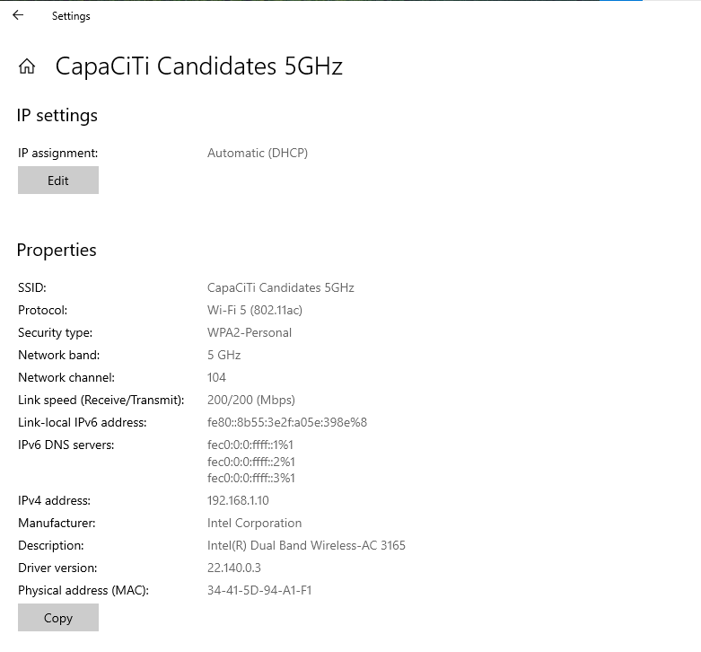
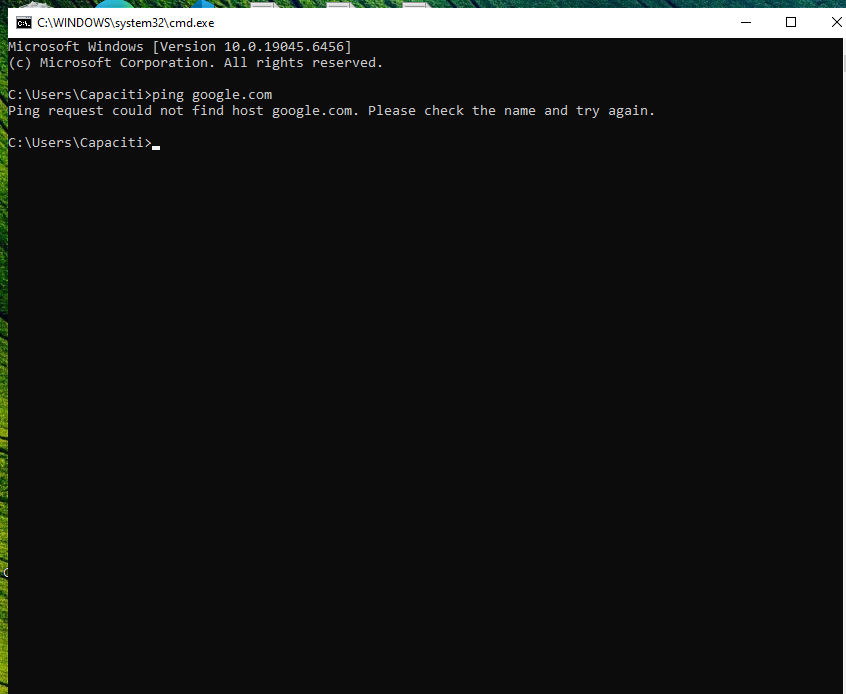
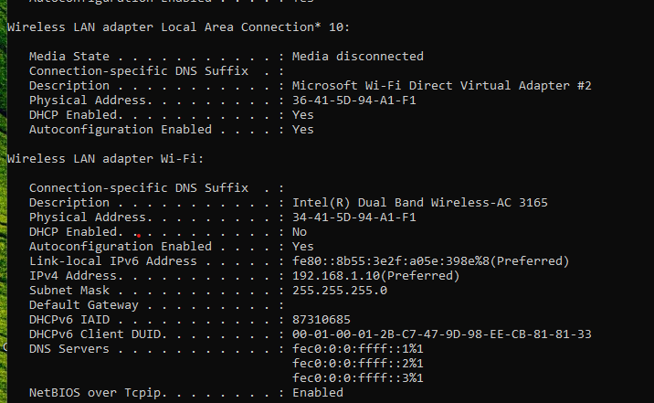
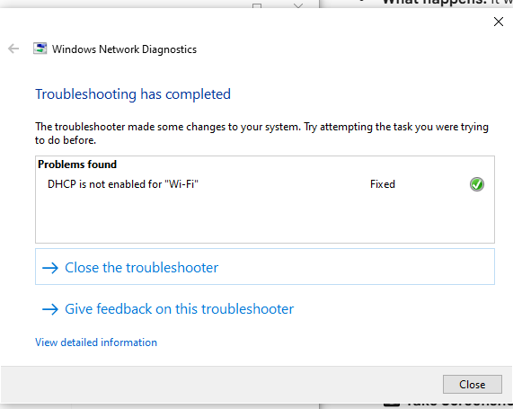

# network-troubleshooting-lab
# Technical Support Troubleshooting Report
**Author:** Thandeka Mbokazi
**Date:** February 11, 2026

## 1. System Information & Network Status
The following specifications were gathered from the personal desktop settings and command line:

* **Network Adapter:** Intel(R) Dual Band Wireless-AC 3165
* **Connection Type:** Wi-Fi 5 (802.11ac)
* **IP Address:** 192.168.1.10

---

## 2. Issue Description
The system was unable to connect to the internet. While the Wi-Fi icon indicated a connection to the SSID "CapaCiTi Candidates 5GHz," no web traffic could be sent or received.

### Initial Verification
I attempted to ping Google to check connectivity. The request failed immediately, indicating a name resolution or connectivity issue.

---

## 3. Troubleshooting & Diagnosis
I ran `ipconfig /all` to inspect the network configuration. I discovered that **DHCP (Dynamic Host Configuration Protocol)** was disabled for the Wi-Fi adapter. Without DHCP, the system was not receiving correct DNS server information from the router.

---

## 4. Resolution
I utilized the **Windows Network Diagnostics** tool to reset the adapter settings. The tool automatically identified that DHCP was disabled and re-enabled it.

**Final Verification:** After the troubleshooter finished, I successfully flushed the DNS and verified that internet access was restored.

📋 Table of Contents
System Specifications

Problem Identification

Root Cause Analysis

Resolution and Verification

Summary of Work

1. System Specifications & Initial Status
The first step involved verifying the hardware and current network configuration to establish a baseline for the troubleshooting process.

Network Adapter: Intel(R) Dual Band Wireless-AC 3165

Physical Address (MAC): 34-41-5D-94-A1-F1

Connection SSID: CapaCiTi Candidates 5GHz

Protocol: Wi-Fi 5 (802.11ac)

2. Problem Identification
I simulated a connectivity failure to demonstrate the troubleshooting workflow. I attempted to reach an external host via the Command Prompt.

Command Run: ping google.com

Result: The request failed with the error: "Ping request could not find host.
Observation: This confirmed that while the hardware was active, the system could not resolve web addresses.

3. Root Cause Analysis
To diagnose the failure, I inspected the deep network configuration using the ipconfig /all command.

Discovery: Under the "Wireless LAN adapter Wi-Fi" section, I identified that DHCP Enabled was set to No.

Diagnosis: Since DHCP (Dynamic Host Configuration Protocol) was disabled, the system was not receiving a valid IP lease or DNS server information from the router.

4. Resolution and Verification
I utilized the built-in Windows Network Diagnostics tool to repair the adapter configuration and restore service.

Troubleshooting Action: The tool identified that "DHCP is not enabled for 'Wi-Fi'."

Correction: I applied the fix to re-enable DHCP automatically.

Final Result: The tool confirmed the issue was Fixed with a green checkmark.

5. Summary of Work
The internet disconnection was resolved by identifying a configuration mismatch where DHCP had been disabled on the primary wireless adapter. By re-enabling DHCP, the system successfully synchronized with the router's settings, restoring full internet access and DNS resolution.
